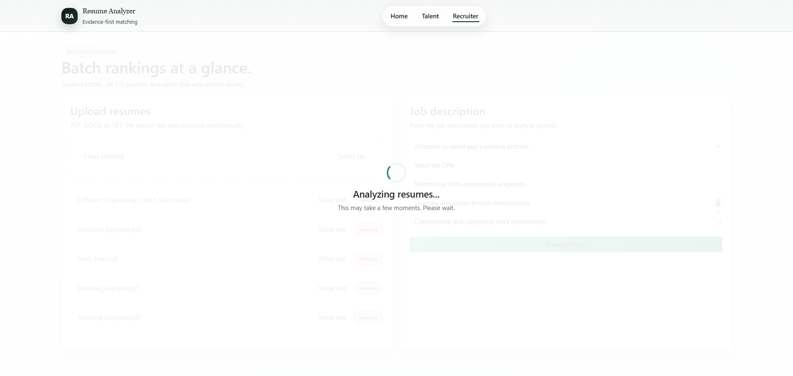
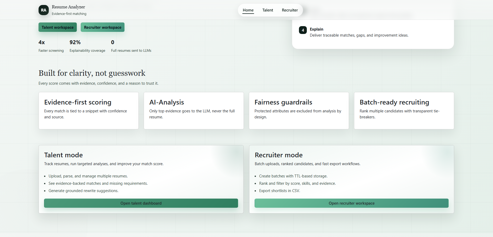
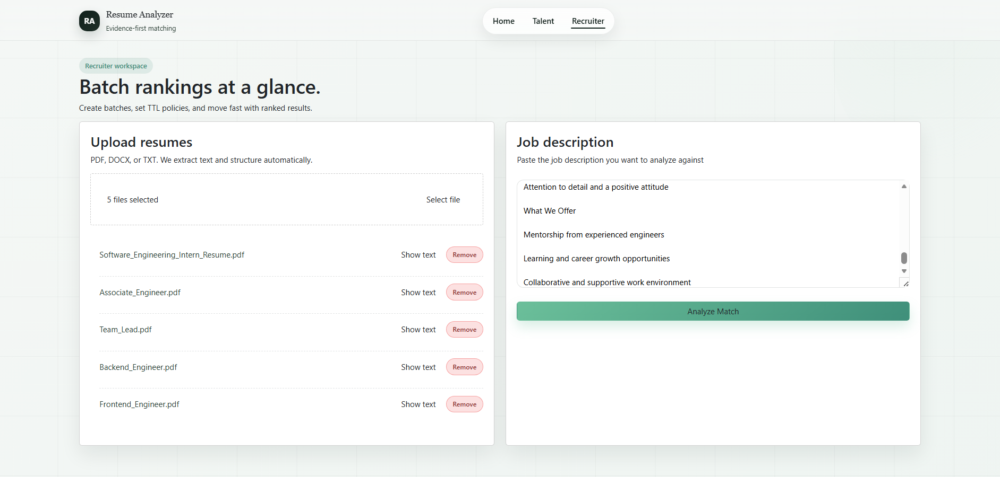
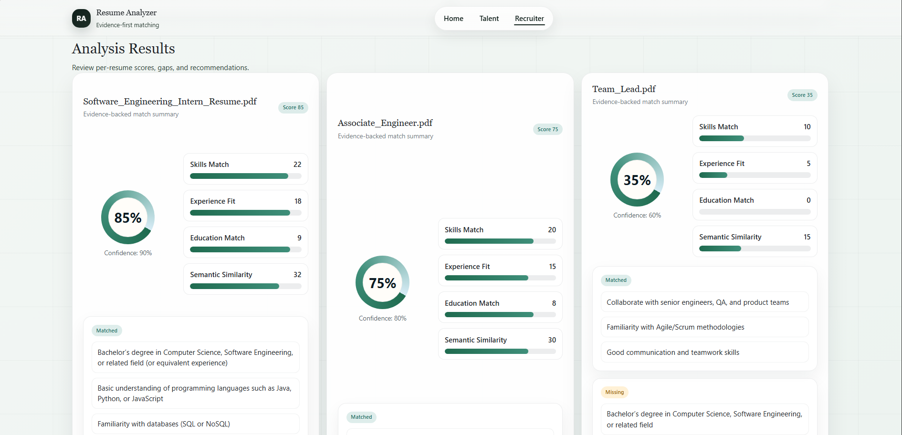
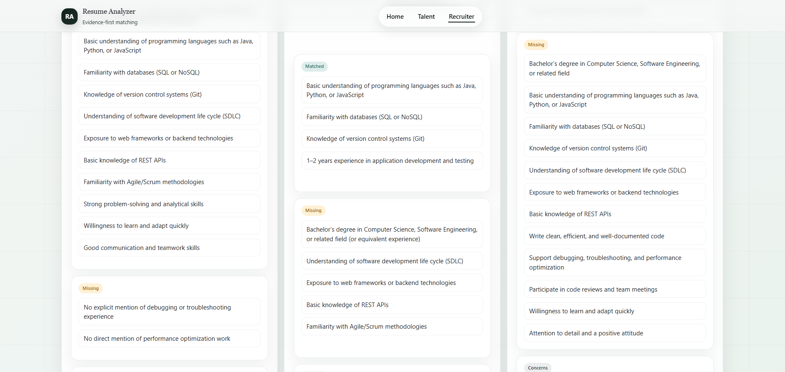
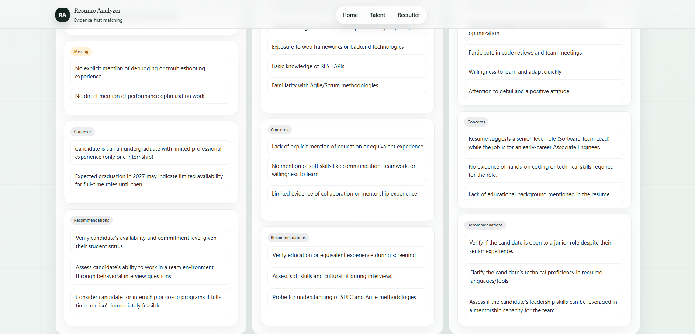
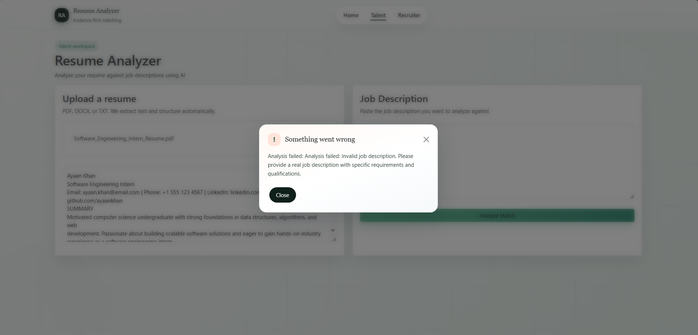
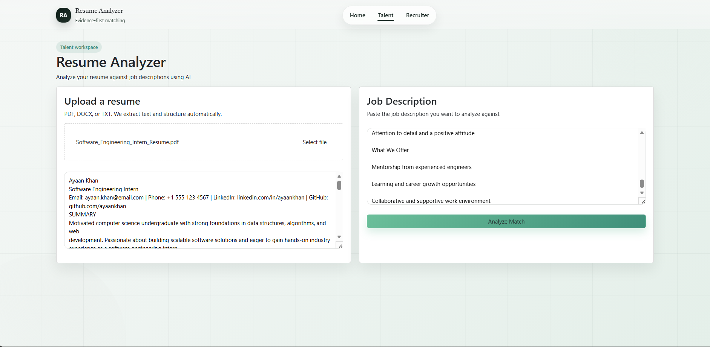
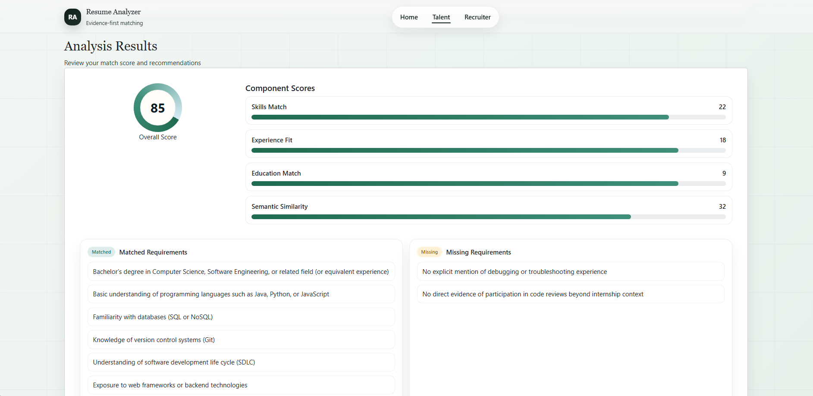
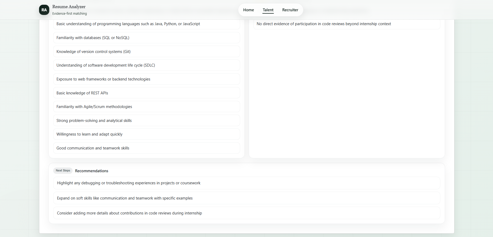

# Resume Analyzer

## Intro
Resume Analyzer is a Django web app that helps job seekers analyze resumes and helps recruiters rank candidates. It includes separate flows for talent and recruiter roles and provides a guided UI for uploads, analysis, and results.

## How to Clone and Run
```bash
git clone <your-repo-url>
cd Resume_Analyzer

python -m venv venv
venv\Scripts\activate  # Windows

pip install -r requirements.txt
python manage.py migrate
python manage.py runserver
```

Open http://localhost:8000 and http://localhost:8000/admin for admin access.

## UI Screenshots











